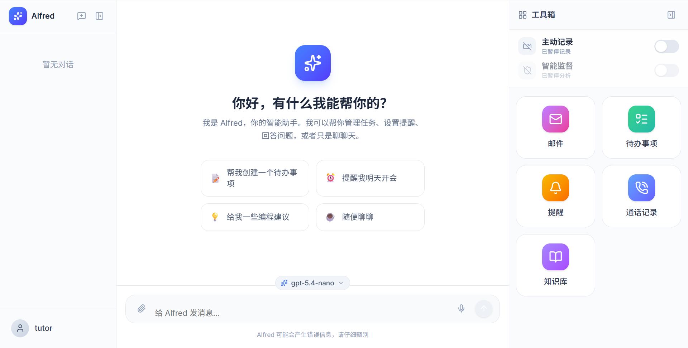
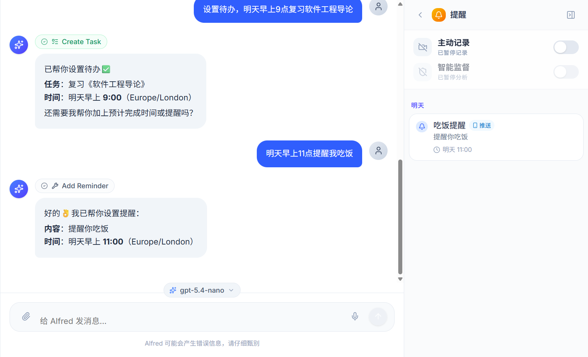
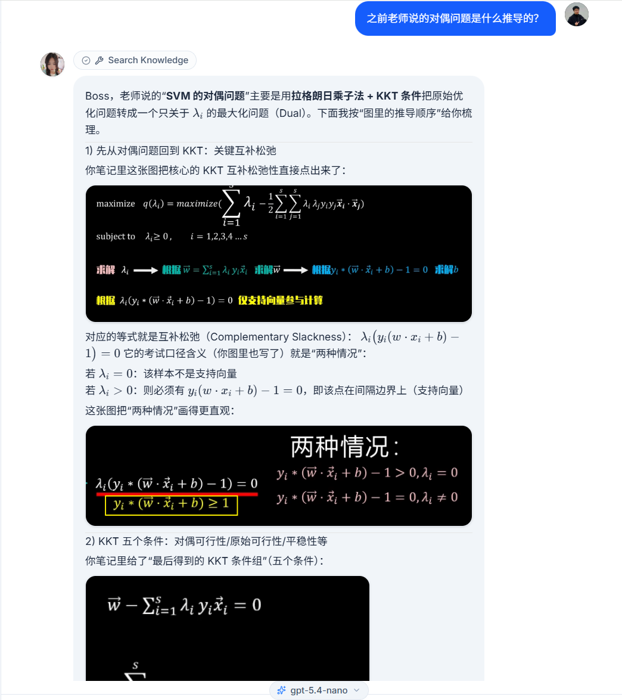
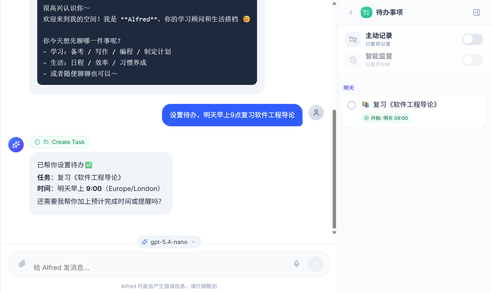
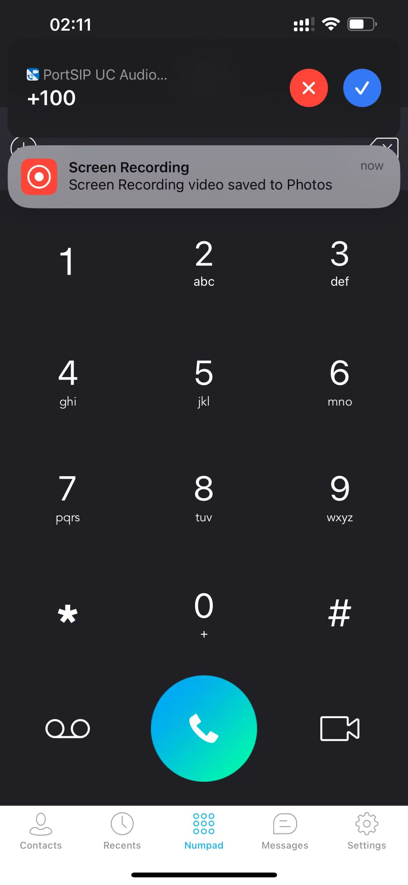
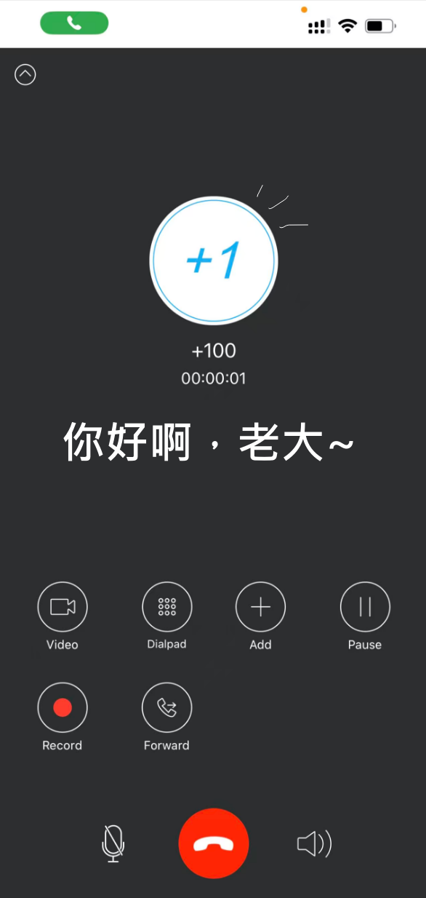
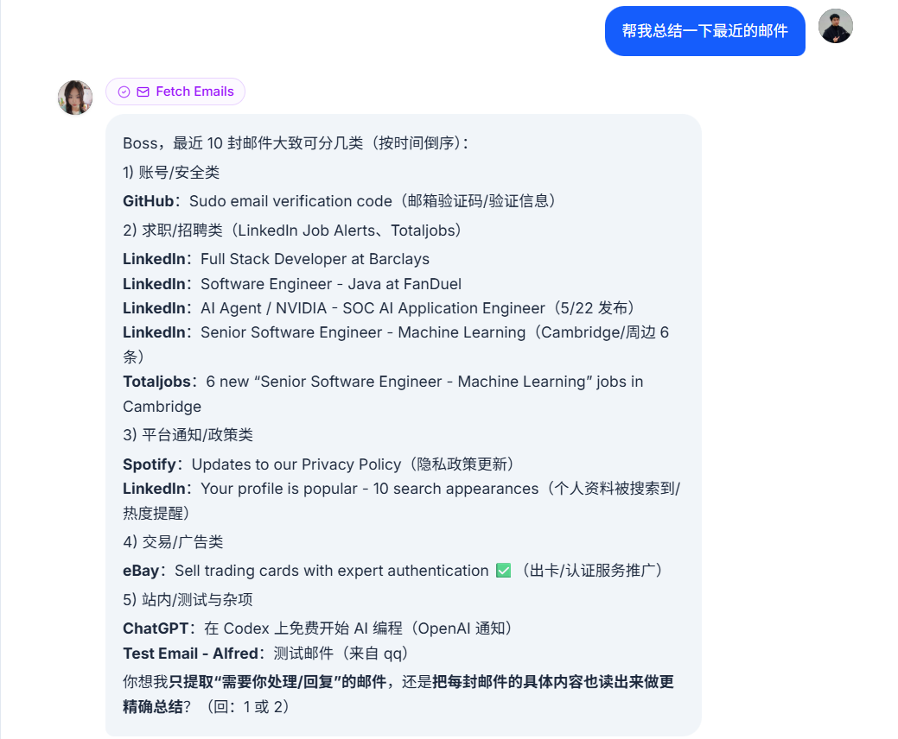
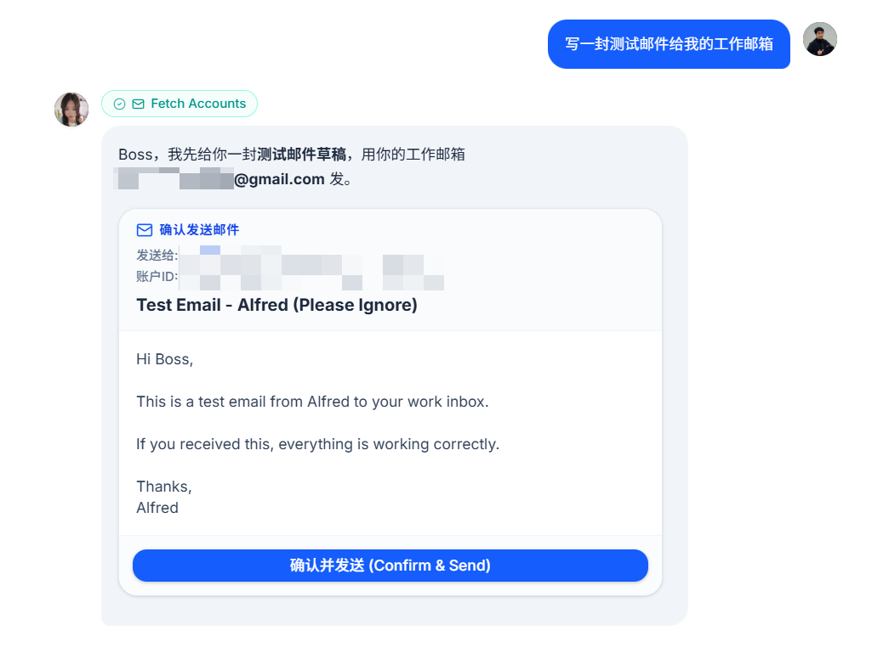
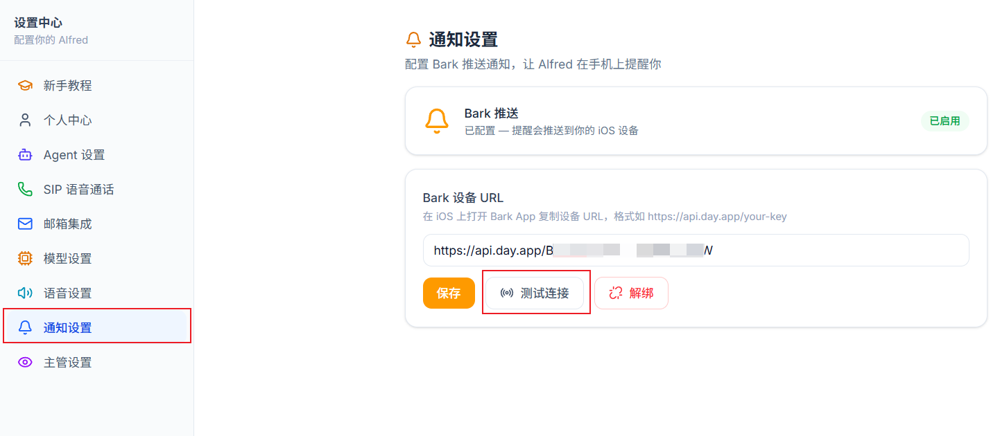

<p align="center">
  
</p>

<h1 align="center">OpenAlfred</h1>
<p align="center">
  <strong>一个会主动找你、会记住你的习惯、为学生场景深度优化的 AI 私人助理</strong><br>
  主动型 · 带长期记忆 · 笔记可引用图片 · 全自部署
</p>

<p align="center">
  
  
  
  
</p>

---

## 它不是聊天机器人

市面上大多数 AI 助手是这样的：你问，它答。你忘了问，它就沉默。

**OpenAlfred 不一样：**

<table>
<tr>
<td width="33%" align="center">
  <h3>🔔 主动型</h3>
  <p align="left">不等你开口。后台监测你的学习状态，到时间了打电话/推送提醒你。检测到分心——直接一通电话打过来。</p>
</td>
<td width="33%" align="center">
  <h3>🧠 带记忆</h3>
  <p align="left">不是金鱼。它会从每段对话中提取关于你的事实、偏好和习惯，存成长期记忆。你提过的东西，下一次它会记得。</p>
</td>
<td width="33%" align="center">
  <h3>🎓 为学生而生</h3>
  <p align="left">上传课堂笔记、PPT 截图、教科书 PDF。Alfred 识别文档里的图片并生成描述，回答时精准引用原文和插图。</p>
</td>
</tr>
</table>

---

## 核心能力

### 🔔 主动来找你，不用你去找它

| 场景 | Alfred 怎么做 |
|---|---|
| 「明天早上提醒我吃饭」 | 到时间 Bark 推送到手机|
| 你在刷视频而不是写论文 | 屏幕监控检测到分心 → 累计到阈值 → 来电提醒 |
| 待办任务逾期未完成 | 主动催促，逐步升级提醒强度 |

<p align="center">
  
</p>
<p align="center">
  
</p>

> 后台运行一个 **Supervisor（主管进程）**，定期截屏 + OCR → LLM 判断当前活动是否与任务相关。检测到你在摸鱼，它真的会打电话给你。

### 🧠 长期记忆，越用越懂你

每轮对话结束后，Alfred 自动从聊天中提取关于你的信息：

- **profile** — 姓名、学校、专业、重要日期
- **preferences** — 喜欢/讨厌的事物、学习偏好
- **patterns** — 作息习惯、工作方式
- **relationship** — 与导师、同学、家人的互动

这些记忆以 Markdown 文件存储在 `memory/{你的用户ID}/` 目录下，**完全透明、可手动编辑**。下次对话时自动注入上下文，Alfred 会基于对你的了解做出更精准的回应。

```
memory/
├── 550e8400-.../
│   ├── profile.md         # "用户是XX大学计算机专业研二学生"
│   ├── preferences.md     # "喜欢用费曼学习法，偏好早上6-8点深度学习"
│   ├── patterns.md        # "每周三下午有组会，周五晚上打篮球"
│   └── relationship.md    # "导师姓王，对论文格式要求严格"
```

### 🎓 学生场景深度优化

#### 笔记上传，图片不用愁

上传你的 Markdown 笔记或 PDF 课件——Alfred 会自动：

1. **按标题分段** — 保留文档结构
2. **复制并描述图片** — 笔记里的截图、图表、公式，由 Gemini 多模态模型生成文字描述
3. **向量化存储** — BGE-M3 嵌入 → ChromaDB

提问时，Alfred 检索相关内容并**引用原文 + 还原图片**：

<p align="center">
  
</p>

> 「根据我的操作系统笔记，虚拟内存和物理内存的区别是什么？」→ Alfred 找到你笔记中的相关章节，文字 + 原图一起返回。

#### 学习任务管理

```
你：帮我记一下，下周五之前要交编译原理的课程设计
你：每周一到周五早上8点提醒我背150个GRE单词
你：列出我这周所有还没完成的任务
你：最近我编译原理的任务进度怎么样
```

<p align="center">
  
</p>

---

## 更多能力

### 📞 语音通话

SIP 协议接入，支持双向通话：

- Alfred 主动打给你（提醒/分心警告）
- 你打给 Alfred（在路上、在厨房，不方便打字时）

语音管线：SenseVoice STT → LLM → Faster-Qwen3-TTS

<p align="center">
  
  
</p>

### 📧 邮件

配置邮箱后：

- 「总结一下导师最近发来的邮件」
- 「帮我看一下上周那封关于开题报告的邮件」
- 起草回复 → 你确认 → 发送（LLM 不能直接发，必须你点确认）

<p align="center">
  
  
</p>

### 🤖 多模型切换

| 模型 | 适合场景 |
|---|---|
| GPT 系列 | 综合能力最强，复杂推理 |
| DeepSeek V4 | 性价比高，中文理解好 |
| Gemini 2.5 Flash | 多模态、图片理解 |
| Cerebras Llama | 极速推理 |
| 本地 Gemma（Ollama） | 隐私优先、离线可用 |

### 🔔 Bark 推送

在 iOS 上装 Bark App，填入设备 URL，Alfred 就能推送到手机。

<p align="center">
  
</p>
<p align="center">
  
</p>

---

## 快速开始

### 你需要

- Python 3.13+ + [`uv`](https://docs.astral.sh/uv/)
- Node.js 20+
- **Redis**（事件总线 + 延迟队列）
- **LiveKit Server**（语音通话，即使不用语音也要装）
- 至少一个 LLM API Key

### 三步跑起来

```bash
git clone https://github.com/codehuang0717/OpenAlfred.git
cd OpenAlfred

# 1. 安装依赖
./setup.ps1      # Windows
# ./setup.sh     # Linux / macOS

# 2. 编辑 agent/.env，填入 API Key
# OPENAI_API_KEY=sk-xxx

# 3. 启动
./start-all.ps1
```

打开 **http://localhost:3000**，注册账号，开始用。

### 安装 Redis

```bash
# Windows: winget install Redis.Redis
# macOS: brew install redis && brew services start redis
# Ubuntu: sudo apt install redis-server && sudo systemctl enable redis-server --now

redis-cli ping  # → PONG 说明装好了
```

### 安装 LiveKit

从 [LiveKit Releases](https://github.com/livekit/livekit/releases) 下载对应平台的二进制文件，放到 `bin/` 目录下。启动脚本会自动检测。

### 可选：语音 Docker 服务

```bash
docker compose up -d sensevoice                    # STT
docker compose --profile gpu build tts             # TTS（需 GPU）
docker compose --profile gpu up -d tts
```

---

## 架构

```
┌─────────────────── 你的电脑 ────────────────────────────────┐
│  Redis :6379    LiveKit :7880    Ear Service (唤醒词监听)   │
│                                                             │
│  ┌──────────────────────────────────────────────────────┐  │
│  │  Agent (Python)          WebUI (Next.js :3000)       │  │
│  │  LangGraph :2024         ├ 对话界面                   │  │
│  │  FastAPI :7788           ├ 设置中心                   │  │
│  │  Worker (后台调度)       ├ 知识库管理                 │  │
│  │  Supervisor (屏幕监控)   └ 邮件面板                   │  │
│  │  LK Voice Workers (:5883, :5884)                     │  │
│  └──────────────────────────────────────────────────────┘  │
└─────────────────────────────────────────────────────────────┘

┌─── Docker (可选) ────────────────────────────────────────────┐
│  SenseVoice STT :8000    Faster-Qwen3-TTS :7017 (GPU)      │
└─────────────────────────────────────────────────────────────┘
```

| 层 | 技术栈 |
|---|---|
| Agent | Python + FastAPI + LangGraph + aiosqlite |
| 前端 | Next.js 16 + React 19 + Tailwind CSS 4 + shadcn/ui |
| 语音 | LiveKit Agents (STT → LLM → TTS) + SIP |
| 知识库 | BGE-M3 向量化 + ChromaDB + Gemini 多模态图片描述 |
| 事件 | Redis Pub/Sub + Sorted Set 延迟队列 |

---

## 项目结构

```
├── agent/               # Python 后端
│   └── src/
│       ├── routers/     # 11 个 API 路由
│       ├── tools/       # 10+ 组 Agent 工具
│       ├── logic/       # LangGraph 状态图 + 提示词
│       ├── services/    # LLM / 邮件 / 通知 / 调度器
│       ├── db/          # aiosqlite (WAL mode)
│       ├── rag/         # 知识库管线（解析→图片描述→分块→向量化→检索）
│       └── livekit_service/  # 语音 Agent
├── web/                 # Next.js 16 前端
├── memory/              # L1 长期记忆（每个用户一个目录）
├── assets/              # TTS 参考音频 + 截图
├── docker-compose.yml
└── setup.ps1 / start-all.ps1
```

---

## License

MIT

---

<p align="center">
  <sub>Built by <a href="https://github.com/codehuang0717">codehuang0717</a></sub>
</p>
