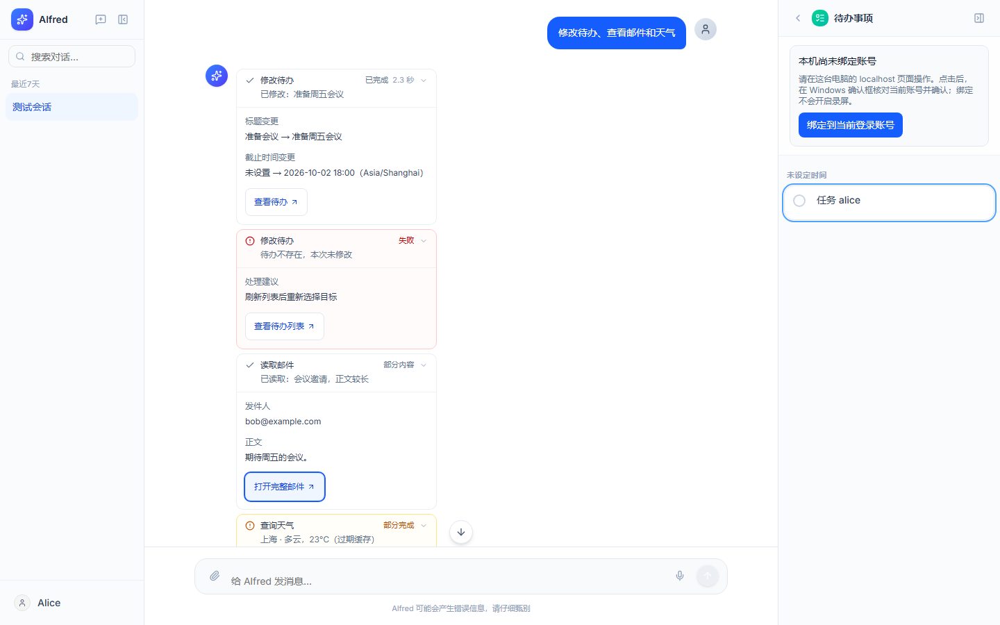
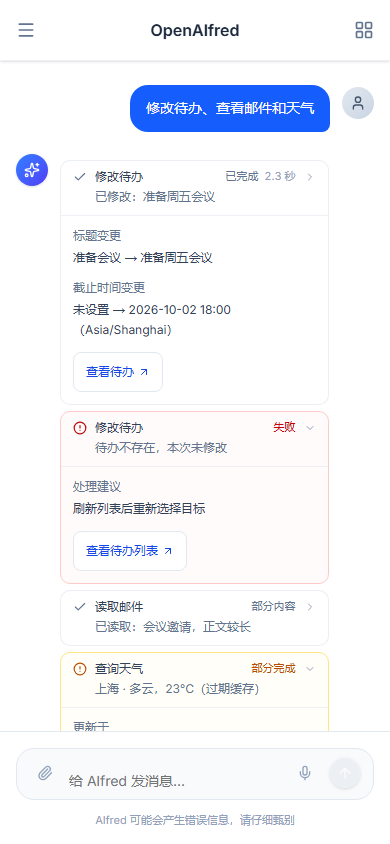

# 功能工具调用展示方案

本方案基于 2026-10-02 的代码检查，覆盖主代理实际注册的 32 个工具，以及后台编码代理的 6 个内部工具。现已在前后端的 `重构` 分支实现结构化结果展示。下方保留各功能的设计清单，文末记录实际实施范围与能力边界。

## 改造前的检查结论

- 注册入口为 `src/tools/__init__.py`。当前没有主代理“浏览器操作”或“仓库检查”工具，不能根据前端残留名称假定这些能力存在。
- `MessageBubble.tsx` 的名称表中有 19 个实际工具缺少专用标签，7 个标签名称已经不匹配实际注册工具，例如 `list_todos`、`set_reminder`、`search_memory`。需要按真实工具名统一中文文案。
- 当前聊天工具状态仅有 `calling/done`，收到工具结果或结束流会标为 `done`，无法表达失败、中断和结果未确认。重载历史也不能丢失这些区别。
- 提醒、邮件、记忆、知识库、天气、屏幕等工具存在“以普通字符串返回业务失败”的路径。`ToolMessage.status` 没有报错不代表业务成功。
- 待办、提醒的修改/删除工具有忽略数据库 `False` 返回值而继续输出成功的路径。展示成功前需要核对是否实际变更。
- 有些所需信息当前只存在输入、业务资源或非结构化文本中，需要补充结构化展示结果。数量、目标标题、变更前后、刷新时间等不得由前端或主模型猜测。

## 公共展示规则

默认一行：**中文动作 · 关键对象或范围 · 真实状态/结果**。正在执行超过几秒时可显示实测已用时间，不伪造百分比或剩余时间。完成后优先展示业务结果，点开再看输入摘要、结果详情和时间。

普通查询结果可以折叠；失败、未完成的修改和需要用户操作的结果保持可见。多个调用可显示“查询 3 项：2 项成功，1 项失败”，展开保留每个调用的对象与结果。相同名称但目标不同的调用不能只合并成 `×3`。

工具调用状态建议使用 `running / succeeded / failed / interrupted / unknown`。另外保存业务结果，如空结果、没有变更、已存在、待采用、已排队。任务排队不等于工作完成；工具成功后主模型回复失败也不应抹掉成功结果。

所有表格都是目标展示方案；未由现有代码提供的字段需要补齐之后才能显示。操作入口复用现有面板和结果卡片，新增入口应明确标为待实现。

## 32 个主代理工具

### 待办：4 个

| 实际工具 | 执行中显示 | 完成显示 | 展开详情 | 操作 |
| --- | --- | --- | --- | --- |
| `get_todos` | 查询待办 · 实际日期范围；未筛选时显示全部待办 | 找到 N 项；展示待完成/已完成数量；空结果明确写“此范围没有待办” | 标题、状态、开始/截止时间，实际筛选条件与用户时区 | 打开待办面板；定位结果项 |
| `add_todo` | 创建待办 · 标题 | 已创建「标题」；有时间时展示日期和时间 | 描述、备注、开始/截止时间；未设置时间明确说明 | 打开该待办并编辑 |
| `update_todo` | 修改待办 · 已核验的目标标题 | 已完成「标题」或“截止时间已调整”等具体改动；无变更/未找到另行说明 | 变更字段的旧值 → 新值；标题、状态、时间、描述等 | 打开修改后的待办；复核改动 |
| `delete_todo` | 删除待办 · 已核验的目标标题 | 已删除「标题」；不存在时不能显示删除成功 | 删除前的标题、时间与说明；保留这次操作的历史快照 | 查看待办列表；当前没有恢复接口，不显示“撤销” |

目标 ID 只在必要的诊断信息中显示，不能让 UUID 成为用户识别对象的主要方式。变更前后与删除对象需要执行时保存，不能事后读取已变化的对象充当原始快照。

### 提醒：4 个

| 实际工具 | 执行中显示 | 完成显示 | 展开详情 | 操作 |
| --- | --- | --- | --- | --- |
| `add_reminder` | 设置提醒 · 提醒标题或正文短句 | 已安排 · 明确日期/时间 · 推送或电话 | 实际保存的触发时间与时区、完整内容、通知方式；电话话术与语音准备结果 | 打开提醒；修改时间或取消 |
| `list_reminders` | 查询提醒 · 实际日期范围 | 待触发 N 条，历史 N 条；最近一条的触发时间 | 待触发和历史分组，内容、时间、方式；“已触发”不能暗示已被用户阅读 | 打开提醒列表；定位最近提醒 |
| `update_reminder` | 修改提醒 · 目标标题或正文短句 | 时间/内容已调整；明确具体字段 | 触发时间、标题、正文的旧值 → 新值；实际时区 | 打开提醒并复核 |
| `cancel_reminder` | 取消提醒 · 目标短句 | 已取消 · 原触发时间；不存在或已处理时说明实际结果 | 原内容、时间、方式与取消结果 | 返回提醒列表；不提供无依据的“撤销” |

安排提醒成功只说明已保存安排，不说明推送已送达或电话已接通。电话提醒预渲染语音失败而安排成功时，应表达“已安排，语音准备未完成”的实际结果，不把整个过程归为单一绿色成功。

### 邮件：6 个

| 实际工具 | 执行中显示 | 完成显示 | 展开详情 | 操作 |
| --- | --- | --- | --- | --- |
| `get_email_accounts` | 获取可用邮箱 | 找到 N 个已配置邮箱；不把“有配置”称为“已验证连接” | 用户自己的邮箱地址、服务商；不显示密码或内部 account_id | 前往邮箱设置 |
| `get_recent_emails` | 查询最近邮件 · 实际邮箱范围 · 请求上限 | 已返回 N 封；部分邮箱失败时单独说明覆盖缺口 | 主题、发件人、日期、所属邮箱、实际成功/失败账号范围；返回数与总数区分 | 打开邮件列表或具体邮件 |
| `read_email` | 读取邮件 · 已知主题 · 所属邮箱 | 邮件已读取 · 主题；正文被截断时明确提示 | 发件人、日期、邮箱与正文；完整正文用邮件详情接口加载 | 打开完整邮件 |
| `create_email_draft` | 保存草稿 · 主题 | 草稿已保存，尚未发送 | 发件邮箱、收件人、主题、当前版本；正文在编辑器中查看 | 打开共用编辑器 |
| `get_email_draft` | 读取草稿 · 已知主题 | 已读取当前版本 · 草稿/排队/已提交等真实业务状态 | 发件人、收件人、版本与保存时间；原始读取快照和当前草稿状态区分 | 打开草稿或发送记录 |
| `update_email_draft` | 生成修改建议 · 主题 | 修改建议已保存，等待采用；原草稿未改变 | 与原版本的字段差异、原版本号、冲突信息；正文差异放建议编辑器 | 查看/采用建议；冲突时重新提出建议 |

发送邮件不是代理工具调用：现有发送必须由用户在编辑器确认，通过 API 创建任务。发送任务卡继续显示排队、提交中、服务器接受、明确失败或结果不确定，不能用“保存草稿成功”代替发送结果。

### 记忆：3 个

| 实际工具 | 执行中显示 | 完成显示 | 展开详情 | 操作 |
| --- | --- | --- | --- | --- |
| `get_user_profile` | 读取个人资料与偏好 | 已读取；无记录则“暂无资料与偏好” | 实际读取的类别；内容由用户展开查看，不在默认行自动铺出私人信息 | 查看相应记忆；当前缺少入口时先补入口 |
| `get_user_memory_category` | 读取记忆 · 中文类别名 | 已读取该类别 / 此类别暂无记录 | 个人资料、偏好、关系、行为模式四类的对应内容 | 查看该类别记忆 |
| `update_user_memory` | 保存记忆 · 中文类别名 | 已记住具体事实 / 已存在无需重复保存 / 未保存并说明原因 | 本次拟保存与实际保存的事实、证据来源、重复或冲突原因 | 查看记忆；有冲突时明确展示待澄清内容 |

`update_user_memory` 实际是审核后追加事实，不是覆盖整个用户画像。“未保存”和“已有相同信息”要与技术错误区别显示。不假定有删除、覆盖或撤销接口。

### 搜索、知识库、天气与历史：5 个

| 实际工具 | 执行中显示 | 完成显示 | 展开详情 | 操作 |
| --- | --- | --- | --- | --- |
| `web_search` | 搜索网页 · 搜索词 | 返回 N 条结果；空结果与搜索失败分开 | 结果摘要、实际来源 URL/域名；当前没有返回标题时不虚构标题 | 打开来源；复制来源链接 |
| `search_knowledge` | 检索知识库 · 搜索词 | 命中 N 个片段，来自 M 个文档 | 文件名、章节、文档加入日期、相关片段与图片；不把检索分数当“可信度百分比” | 打开知识库来源；无定位能力时不承诺跳到精确原文 |
| `list_knowledge` | 列出知识库文档 | 共 N 个文档 / 知识库为空 | 标题、文件名、格式、加入时间；片段数量放次要信息 | 打开知识库；空结果入口引导添加文档 |
| `get_weather` | 查询天气 · 实际解析的地点 · 请求日期 | 实际返回地点的天气与温度；过期缓存单独提示 | 实际预报日期、温度、降雨、风、数据更新时间；城市和默认位置的选择来源 | 展开预报；未设置位置时前往天气设置 |
| `read_context_excerpt` | 回查本次会话记录 | 已读取历史片段；还有后续则“已读取部分” | 记录类型、关联的用户消息或工具；读取范围、是否截断；不默认显示 ctx 哈希与原始载荷 | 有可定位记录时跳回对应消息；分页合并展示 |

已检查的能力边界：`list_knowledge(query=...)` 当前没有应用 query 筛选；`get_weather(date=...)` 的日期主要用于格式化已有预报，不能宣称任意日期已查询；自然语言“明天”需要先解析到用户/地点对应的实际日期。天气格式化文本当前未携带所有缓存元数据，展示更新时间与过期状态需要补充输出。

### 屏幕与活动：3 个

| 实际工具 | 执行中显示 | 完成显示 | 展开详情 | 操作 |
| --- | --- | --- | --- | --- |
| `view_screen` | 读取近期活动（最近 5 分钟）/搜索活动/查询时间段；按实际模式展示 | 返回 N 条记录；显示实际覆盖时间 | 记录时间、应用、窗口、内容类型；文本或转录由用户展开查看 | 展开记录；有分页时显示当前返回数与总数 |
| `search_screen_time` | 查询活动 · 起止时间；应用/关键词仅在实际应用时显示 | 此时间段返回 N 条记录 / 无记录 | 实际时间范围、时区、应用筛选、内容类型与匹配项 | 查看时间段结果 |
| `take_screenshot` | 分析当前屏幕 · 用户问题短句 | 屏幕分析完成；标注这是模型分析结果 | 分析问题、采集时间与分析文本；采集失败和模型分析失败区分 | 展开分析；当前工具不返回可供预览的图片，不显示无效“查看截图”按钮 |

`view_screen(current)` 当前读取 Screenpipe 最近 5 分钟记录，不能称为“实时截图”。current 模式没有应用 query/app_name，history 模式也没有应用 app_name；展示范围应来自实际执行参数。查询 OCR、UI 或输入记录不说明音频采集成功，也不能仅凭结果为空断定用户没在操作。

### 生成与小程序：5 个

| 实际工具 | 执行中显示 | 完成显示 | 展开详情 | 操作 |
| --- | --- | --- | --- | --- |
| `generate_image` | 生成图片 · 提示词短句 · 请求尺寸 | 图片已生成；用缩略图作为主要结果 | 完整提示词、请求尺寸；auto 时实际尺寸从图片元数据获取；结果图复用已保存 artifact | 放大查看/保存图片；不自动重试可能已计费的生成 |
| `create_todo_timeline_panel` | 配置待办时间线 · 标题 | 时间线已配置；创建还是更新由真实保存结果决定 | 按开始/截止时间排列、是否包含已完成项、说明；颜色作为次要设置 | 打开右侧时间线；不称为创建了待办 |
| `create_standalone_mini_app` | 提交生成任务 · 小程序标题 | 已提交后台任务；随后展示排队/编写/检查/修复/待预览等真实阶段 | 需求摘要、模型、实际阶段、数据来源与快照限制、检查报告 | 复用编码任务卡：预览、按现有流程发布或取消 |
| `get_coding_task` | 查看生成进度 · 小程序标题 | 更新同一张任务卡的真实状态，不堆叠重复卡片 | 完成报告、失败原因、已进行的检查与未进行的验证 | 定位现有任务卡；按真实状态提供可用操作 |
| `cancel_coding_task` | 取消生成 · 小程序标题 | 任务已取消；单独核对该版本是否已发布与已有版本情况 | 取消结果与实际任务阶段；明确现有已发布版本的真实状态 | 查看任务卡或返回小程序列表 |

源码检查通过不能称为浏览器功能测试通过。后台生成完成意味着候选版本可预览，不能称为已发布。图像、草稿、小程序均复用业务结果卡，工具行提供摘要与入口，避免重复展示相同完整结果。

### 电话：2 个

| 实际工具 | 执行中显示 | 完成显示 | 展开详情 | 操作 |
| --- | --- | --- | --- | --- |
| `make_outbound_call` | 正在拨打你的号码/分机；已解析目标用脱敏显示 | 已接通 / 未接通；电话失败且备用推送提交成功显示“未接通，备用推送已提交” | 实际呼叫目标、初始话术、呼叫结果与备用推送结果；不把未接通归为电话成功，也不声称用户已读推送 | 进入通话详情；不提供自动重拨 |
| `request_end_call` | 正在准备结束通话 | 已请求结束；实际挂断后才显示通话已结束 | 简短说明将结束当前通话；延迟等待跟进时以实际通话状态为准 | 显示在通话界面；文本聊天不暴露这个语音专用工具 |

## 后台编码的 6 个内部工具

默认在一个编码任务中合并为阶段进度。用户展开任务详情后才逐条显示；不会把内部源码读取全部铺在主聊天里。编码代理复用的 8 个私人只读工具，沿用前面的对应规则，在任务详情说明实际读取了哪些数据。

| 内部工具 | 展示内容 | 必须说明的边界 |
| --- | --- | --- |
| `list_files` | 查看任务文件 · N 个源码文件；数据文件数单独列出 | 当前任务的虚拟文件，不是宿主机或整个仓库 |
| `read_file` | 读取 `app.js` 等文件 · 实际行范围；数据快照用业务类别名 | 截断或有下一页需明确；哈希与生成的数据路径不默认展示 |
| `write_file` | 编写/替换 `index.html` 等文件 · 实际文件名 | 完成后可看源码；字符数不是新增行数，也不代表功能已完成 |
| `apply_patch` | 修改指定文件 · 查看实际差异 | 版本冲突显示重新读取需求；不能从输入片段猜测已改成功 |
| `validate_app` | 检查代码限制和 JavaScript 语法 · 通过/问题数量 | 展开具体检查项及错误；明确浏览器测试未运行 |
| `finish_task` | 生成完成，等待预览 · 实际功能报告 | 展示数据快照来源与限制；当前候选版本尚未发布 |

仓库静态检查脚本 `scripts/check_repo.py` 不属于上述代理工具。若以后将其接入聊天，应显示实际检查命令、范围、通过/失败项和诊断位置，且与小程序的 `validate_app` 分开命名。

## 需要的数据契约与改造顺序

1. 先修正业务状态：工具返回结构化的成功、失败、无结果、未改变、重复、待采用等结果；检查数据库变更返回值。不要以正则匹配任意文字长期判断成功。
2. 按 32 个真实工具名建立展示定义，逐个列出可展示的输入和结果字段。额外参数默认不显示，主模型不得负责生成具有执行结论的 UI 文案。
3. 为每次调用保存 `call_id`、工具名、展示用输入摘要、执行结果、关键资源引用和时间。修改类保存目标与变更快照；内部 user_id、凭据、令牌、完整私人载荷不进入通用展示字段。
4. 以 ToolMessage artifact 或等效结构化事件传递经过筛选的展示数据，同时保留模型需要的工具内容；实时消息和持久历史使用同一份展示数据。
5. 前端按业务结果渲染紧凑摘要、详情与链接。动态后台任务通过 job_id 更新业务卡片；历史操作快照不被后来资源修改覆盖。

异常状态只由执行链路提供。读取工具失败可由用户明确重试；写入、拨号、图像生成不能默认自动重试。即使图像生成没有本地产物，也不能断定远端没有完成或计费。结果未知时显示待确认，不把它转成成功或普通失败。

## 已实施

- 后端为全部 38 种工具提供中文动作名与明确业务观察。执行适配层保留原有模型返回内容和图片 artifact，把同一份 `ToolDisplay` 写入 ToolMessage artifact，并通过 `tool_display` 自定义事件提供实时更新。同步、异步、Command 返回和并发调用均经过真实 ToolNode 测试。
- 前端按调用 ID 保留独立记录，显示动作、真实摘要、执行状态、实测耗时。展开后显示范围、计数、变更旧值 → 新值、业务结果、开始/结束的本地时间与操作入口。失败、结果未知、审核未批准、部分完成默认展开；不同对象不再只合并成次数。
- 待办/提醒修改和删除检查对象存在性及数据库返回值；提醒短 ID 不唯一时不执行。变更详情来自实际读取的前后快照。写入已确认、后续刷新失败时保留写入结果并标出部分完成。
- 邮件显示最近邮件与逐邮箱读取覆盖情况、发件人/收件人、正文摘要、草稿版本以及修改建议的实际差异。全部邮箱失败会报错，部分失败不会被伪装为全范围空结果。草稿与建议明确尚未发送，复用邮件编辑器与发送记录。
- 记忆区分已追加、无内容、重复、审核未批准与技术失败；知识库显示实际来源、章节与片段；天气显示实际地点、预报日期、观测/更新时间、过期缓存，并处理明天/今天与超出预报范围的情况。
- 屏幕工具显示实际查询范围、返回数量、分页总数及记录；不展示未应用的筛选条件。截图工具仅展示这次分析文字与截取时间，不生成不存在的截图入口。
- 图片复用已有受保护的图片预览。生成连接中断显示结果未知和可能已处理/计费，不自动重试。电话区分接通、未接通与接通结果未知，备用推送的提交不等于用户已读；挂断工具只报告已请求结束。
- 小程序工具显示排队、实际进度与取消结果。后台编码的 6 种工具在任务卡的“查看编码步骤”中逐条展示，区分源码策略/语法检查和未执行的浏览器功能测试；待预览版本不显示为已发布。私人读取的正文不会复制到通用编码进度数据里。
- 操作入口覆盖待办/提醒定位、邮件完整阅读、草稿编辑、知识库列表、来源网页、设置、时间线和小程序。手机端会打开对应工具箱抽屉。已删除或无权限的小程序提供明确反馈。
- 实时接收、停止执行、历史重载共用配对规则。旧记录没有结构化结果时显示“结果未知”，不会根据普通成功文案补造历史证据。停止时未确认的写入保留未知，读取保留中断；已确认的结果不被后续事件覆盖。

## 实际能力边界

- 表格中的精确知识片段跳转、回跳历史消息与手动分页合并没有对应现有业务入口；本次提供来源/原文片段、范围和是否截断，知识库入口打开当前文档列表。
- `list_knowledge` 仍列出全部文档；`view_screen(current)` 仍查询最近 5 分钟活动，current/history 的未应用筛选不展示为已应用。
- 图片展示请求尺寸，真实效果由已保存图片预览表达，不从 `auto` 猜测实际尺寸。
- 通话接听与备用通知来自服务的实际确认；“已请求挂断”不是已实际挂断。工具行不是持续同步的通话监控器。
- 通用详情最多 40 个字段，合计约 12,000 字符；长字段有省略提示，可用业务入口查看完整资源。编码任务保留最多最近 40 个观察，主聊天不会铺开内部源码调用。
- 历史结果保存操作时的快照，业务入口读取当前资源；被删除的对象不提供虚假的恢复操作。网页链接只允许无嵌入凭据的 HTTPS 来源，私人资源使用登录账号的权限读取。

## 验证

- 后端：`uv run python scripts/check_repo.py --tests`，367 项 unittest 通过；静态检查与 OpenAPI 快照通过。
- 前端：`npm test`，83 项测试通过；`npm run check` 与 `npm run build` 通过。ESLint 保留 11 条原有警告，无错误。
- 浏览器：`npm run test:browser`，覆盖实时观察、同名调用的不同结果、历史回放、停止后的未知状态、完整邮件入口、手机端定位和编码内部步骤。20 项浏览器测试全部通过。
- 验证使用合成业务数据和模拟外部服务，没有发送真实邮件、拨号或进行收费的图像生成。

桌面与手机截图保存于 `assets/screenshots/`。复核确认：失败有独立红色提示；需要处理的结果使用琥珀色；移动端摘要独占第二行，状态和耗时不挤占结果文本；无横向溢出，业务入口可直接打开对应抽屉。

